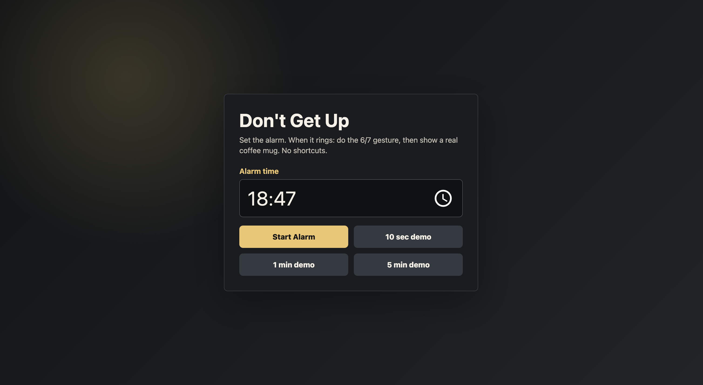
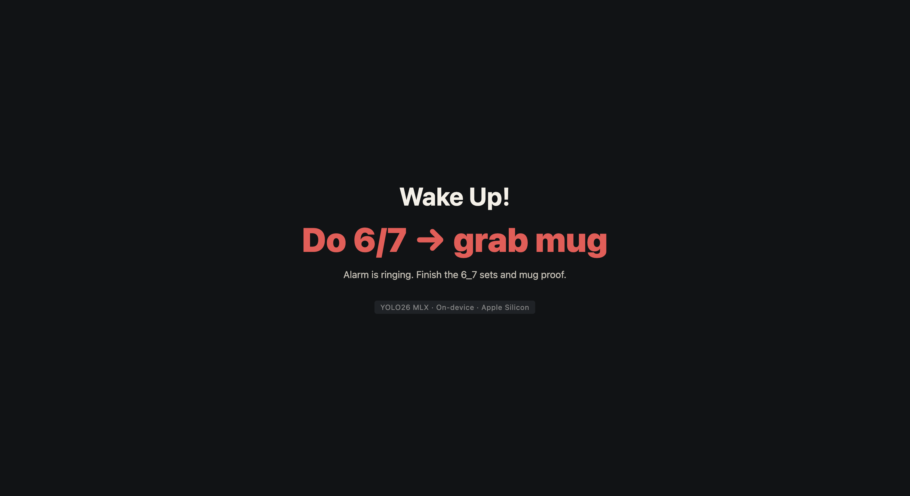

# Don't Get Up

**The alarm that won't stop until you actually wake up.**

Set it once. When it rings, you have to do the 6/7 gesture — both arms alternating up and down like a balancing scale — _and_ hold a real coffee mug in front of the camera. No snooze button. No shortcuts. Runs fully on-device with YOLO26 MLX on Apple Silicon.

## Demo

Demo video link: https://youtu.be/vi7vPIOT0Yw

| Setup | Ringing |
|:-----:|:-------:|
|  |  |

## What it does

When the alarm fires, two things have to happen in order:

**Stage 1 — Do the 6/7:**  
Hold both arms forward and alternate them up and down like a weighing scale — the 6/7 meme gesture. Complete 2 sets. YOLO26 MLX's pose model tracks your wrist keypoints in real time and counts alternations. It resets if you stop.

**Stage 2 — Grab a real mug:**  
Hold a physical coffee mug in front of the webcam for ~2 seconds. The custom-trained mug detector confirms it's real. Show your phone with a photo of a mug instead? It says _"Na na buddy! That won't work, not with me."_ and keeps the alarm going.

Both stages completed → alarm off → "Good morning. Rise and shine!"

## Why we built it

Sleep inertia is the enemy. Snooze buttons are its weapon. Every "alarm clock" app assumes you'll cooperate — that you'll stand up or solve a puzzle while you're still half-asleep. This one makes you prove you're actually awake: your arms have to be moving, your brain has to know which hand is which, and you had to walk to the kitchen. The 6/7 gesture is the modern Gen Z version of "solve this math problem to snooze" — but actually annoying enough to work.

If the Artemis crew can do 6/7 in space, you can do it right after waking up.

## Track

**Wild.** The hackathon prompt literally lists "an alarm clock that only stops when it detects you holding a coffee" as a Wild example — we took that and added a layer: you have to earn the mug by first doing the internet's most recognizable hand gesture. The alarm has opinions. It will taunt you for trying to cheat it with a phone photo. It will not negotiate. It is, objectively, unhinged — and that's the point.

## Hardware

- Apple M3 Pro - 18GB RAM, macOS 15
- Built-in webcam

## Model variant

- **Pose detection**: `yolo26n` (nano, pose variant) — converted to MLX `.npz` format, runs on Apple Silicon Neural Engine
- **Mug/phone detection**: `yolo26n` fine-tuned on a custom ~200-image dataset (mugs held at webcam distance, phone spoof attempts)

## Setup

### Requirements

- macOS 13 or later
- Apple Silicon Mac (M1 or later)
- Python 3.12
- Camera permission for your terminal app

```bash
# Grant camera access: System Settings > Privacy & Security > Camera
```

### Install

```bash
python3.12 -m venv .venv
source .venv/bin/activate
pip install -e ".[dev,convert]"
```

### Get the pose model

```bash
bash scripts/download_weights.sh
python scripts/convert_weights.py \
  --pt models/yolo26n-pose.pt \
  --out models/yolo26n-pose.npz
```

Verify:

```bash
ls -lh models/
# yolo26n-pose.npz  ~14 MB
# mug_phone.safetensors  ~10 MB  (custom-trained, included in repo)
```

## Run

```bash
python scripts/run_alarm_gui.py --config configs/pose_alarm_demo.yaml
```

Opens a browser tab at `http://127.0.0.1:8767`. Click **10 sec demo** to trigger the alarm in 10 seconds.

### User flow

1. Set the alarm time (or click a demo button)
2. Keep the terminal running — browser shows the countdown
3. When the alarm rings, the camera window opens
4. Do the 6/7 gesture until the progress bar fills (Stage 1)
5. Grab a coffee mug and hold it to the camera (Stage 2)
6. Alarm stops → "Good morning. Rise and shine!"

### Camera window overlay

| Element | Meaning |
|---------|---------|
| Green skeleton lines | Arm joints detected by YOLO26 MLX pose model |
| Progress bar (green) | Stage 1: 6/7 gesture completion |
| Progress bar (blue) | Stage 2: mug hold duration |
| "Na na buddy!" + red box | Phone detected — mug counter resets |
| `YOLO26 MLX \| Apple Silicon` label | Confirms on-device inference |

## CLI alternatives

Ring in 30 seconds:

```bash
python scripts/run_pose_alarm.py --config configs/pose_alarm.yaml --alarm-in 30s
```

Ring at a specific time:

```bash
python scripts/run_pose_alarm.py --config configs/pose_alarm.yaml --alarm-at 07:30
```

## Troubleshooting

**No camera window appears:**  
Enable camera access for Terminal / your IDE under System Settings > Privacy & Security > Camera. Fully quit and reopen the app after granting permission.

**First run downloads `yolo26n-pose.pt`:**  
The app is not using the MLX backend. Check that `configs/pose_alarm_demo.yaml` has `backend: mlx` and `weights: models/yolo26n-pose.npz`.

**Can't hear the alarm:**

```bash
afplay assets/voice/alarm_loop.m4a
```

## Technical implementation

- Pose keypoints `LEFT_WRIST` and `RIGHT_WRIST` are compared each frame; alternation of which wrist is higher is counted as one 6/7 movement
- Phone spoof detection uses a custom `yolo26n` detector trained separately on ~80 phone-screen images
- Audio ducking: voice prompts drop alarm to 20% via stdin commands to a native Swift `AVAudioPlayer` subprocess
- Looping alarm runs in a separate Swift process so Python doesn't block on audio
- All inference runs locally on Apple Silicon — no internet required after setup

## Social post

[X](https://x.com/saksham_adh/status/2058712860935512244) — #YOLOMLX

---

*Built for the webAI × HackAI × AITX YOLO26 MLX Hackathon, May 18–24 2025.*
